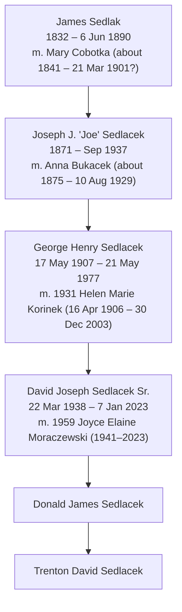

# Sedlacek patrilineal line

Father-to-son line from the earliest known Sedlacek down to Trenton David Sedlacek.

## Generations

| Gen | Name | Born | Died | Wife | Sources |
|---|---|---|---|---|---|
| 1 | James Sedlak (Sedlack, Sedlacek) | 1832 (chart; burial age 59 gives about 1831) | 6 Jun 1890, age 59 | Mary Cobotka | Charts; Holy Sepulchre burial register, grave 1012 ("James Sedlack") |
| 2 | Joseph "Joe" Sedlacek | 1871 (chart; death article age 68 gives about 1869) | Sep 1937, Plattsmouth; found dead in a ditch just east of his home at 15th and Main | Anna Bukacek (d. 10 Aug 1929, age 54) | Charts; Find a Grave [22794841](https://www.findagrave.com/memorial/22794841/joseph-sedlacek); Holy Sepulchre lot 49, sec. 3; clippings 11, 22 |
| 3 | George Henry Sedlacek | 17 May 1907, Plattsmouth, Cass Co., NE | 21 May 1977, Omaha, NE | Helen Marie Korinek (16 Apr 1906 – 30 Dec 2003), m. 1931 | Find a Grave [155297524](https://www.findagrave.com/memorial/155297524/george_henry-sedlacek); headstone photo (dates confirmed); buried Calvary Catholic Cemetery, Omaha, Station 09 |
| 4 | David Joseph Sedlacek Sr. | 22 Mar 1938, Omaha, NE | 7 Jan 2023, Omaha, NE | Joyce Elaine Moraczewski (1941–2023), m. 1959 | Find a Grave [255616923](https://www.findagrave.com/memorial/255616923/david_joseph-sedlacek); buried Forest Lawn Memorial Park, Omaha |
| 5 | Donald James Sedlacek | | | | Family (Trenton) |
| 6 | Trenton David Sedlacek | | | | Self |

## Uncles' lines: Joseph A., Emil, Albert (agent search, Sep 2026)

This comes from search snippets only; none of the pages were opened. Confidence is marked C (confirmed in an obituary snippet), L (likely), S (speculative). None of these people appear on the historian's charts, so there are no deviations to log.

**Joseph A. Sedlacek (b. 1894), the richest branch.** Possibly "Joseph **August**" (L, Ancestry index). His first wife was Ida **Irene** Delisle (L). His death and burial were not found.
- **Bernard Sedlacek**, 25 Apr 1921 Grand Island – 29 Dec 2014 Bellevue, NE. Parents given as Joseph August Sedlacek and Ida Irene Delisle (L). This is a son we didn't know about. No children found yet.
- **Kenneth M. Sedlacek**, m. Eleanor Kassmeyer 1941. Lived in Columbus, NE in 1943 and died before 2025 (C).
  - **Donald K. Sedlacek**, 26 Jan 1943 Columbus – 13 Oct 2025 Council Bluffs, IA. Army 1964; retired from Union Pacific as a Special Agent in 1998. Wife Sharon; children Scott (Tina), Shelley Ragland, Stacy (C, [Hoy funeral home obituary](https://www.hoyfuneral.com/obituaries/donald-sedlacek)).
    - **Scott Sedlacek**, living (C). Grandsons **Brandon** and **Troy** (m. Morgan) Sedlacek are named; that they are Scott's sons is L.
- **Edgar S. Sedlacek**, died 15 Sep 1981. Navy in WWII. Married Maxine May Kamper (31 May 1925 – 30 Jun 2016) on 30 Mar 1944 in San Diego. They lived in Lexington, then Grand Island, then 29 years in North Platte (C, [Maxine's obituary](https://nptelegraph.com/obituaries/maxine-may-sedlacek-williams/article_bbee788c-3ffb-11e6-b8ea-473fbe6a8dda.html); Find a Grave 166301758).
  - Six sons (C):
    - Stan (Nancy), Broken Bow
    - Pat (Eileen), Cheyenne
    - Lee (Janie), North Platte
    - Gene (Marsha), North Platte
    - Tom (Merry), North Platte
    - Lynn Raymond, died 23 Apr 2026 in North Platte; m. Beth 1976 (C, [Carpenter Memorial obituary](https://www.carpentermemorial.com/obituaries/lynn-sedlacek)). His son **Tony Sedlacek** (Christina) lives in Gothenburg, NE.
  - Daughters: Paula (Woods), Debra Kizer, Gail (deceased), Sandra Jensen, Suzy Dodson. Maxine had 27 grandchildren. The sons of Stan, Pat, Lee, Gene, and Tom have not been searched yet.
- Goldie Agnes (Gehley) and Camilla: nothing new.

**Emil Joseph Sedlacek (1898–1992): probably no male line (L).**
- Married **Marie Theresa Klinge** (16 Jan 1896 – 17 Jun 1988), who is buried at Riverview Cemetery, Green River, WY (Find a Grave 75251506, L). Emil is probably buried there too. Her father, Joseph John Klinge Sr. of Grand Island, names "Mrs. E. J. Sedlacek, Green River, Wyo." as a daughter.
- Daughters:
  - Elaine Marie (1925–2000, m. Jerry Gruber)
  - Rita S. (1928–2025, m. Jim Kelly), who is the "baby" in clipping 08
  - Emily Ann (1935–2015, m. Richard Macy)
- No son was found, and the daughters' obituaries mention no brother. A son who died young would not show up in them; the 1930 and 1940 Green River census would settle it.

**Albert Sedlacek: still unidentified.**
- Probably born about 1904 in Nebraska (L, from a WikiTree index entry managed by Dan Lamb).
- Married by 1929 and living in Junction City, KS (C, clipping 12).
- Wife, children, and death date were not found.
- Other Albert Sedlaceks that were checked and are probably not ours:
  - **Al (Albert Joseph) Sedlacek** of Pocahontas, Iowa (died 1990; m. Berniece Ricklefs 1941; sons Jon 1942–2021 and Joel). He is the only candidate with sons. He would be ours only if a record shows he was born in Nebraska around 1904. S.
  - **Albert Sedlacek** of Wenatchee, WA (m. Camilla Havlen 1937 in Illinois; daughters only). Probably not ours.
  - **Albert Sedlacek** of Manchester, CT. Not ours.
- **Checked 27 Sep 1937 p.2** (the user pulled it): it holds only Cass County news and the county board's claims, with nothing on Sedlacek. The only mention there is Deputy Sheriff Cass L. Sylvester's salary. Joseph's funeral notice is still unfound; search "Sedlacek" in all Sep–Oct 1937 issues.
- Earlier lead, now checked: the **Plattsmouth Journal, 27 Sep 1937 p.2** (https://nebnewspapers.unl.edu/lccn/2016270206/1937-09-27/ed-1/seq-2/ocr/). It is probably Joseph's funeral notice with a survivor list, which would show where Albert lived in 1937.

## Holy Sepulchre burial register (Plattsmouth)

The full list of Sedlak/Sedlacek rows is in `sources/holy-sepulchre-sedlak-excerpt.txt`. The register was compiled from the Holy Rosary and St. John the Baptist parish records.

- **James:** "James Sedlack, died 6 Jun 1890, age 59." That makes him born about 1830–31, matching the chart's 1832. No lot is recorded.
- **Mary, probably James's widow:** "Mary Sedlacek, died 21 Mar 1901, age 60" (born about 1840–41). She is buried in **lot 49, section 3, Joseph's family lot**, alongside his children. That makes her very likely Mary Cobotka, Joseph's mother. It is not stated outright.
- **Joseph's family lot (49/3)** also holds Anna (died 10 Aug 1929, age 54), Joseph (Sep 1937), and these children who died young:
  - William (about 1896 – 7 Jul 1898)
  - Marie (died 15 May 1900, 1 day old)
  - a stillborn infant of "Jos. Sedlacek" (18 Jun 1901)
  - Edward (about 1904 – 2 Mar 1906, died of meningitis in **Havelock**)
  - a stillborn infant (Jul 1907)
  - Charles (about Nov 1914 – 15 Mar 1915, died in **Grand Island**, "son of Joseph Sedlock and Anna Bukacek")
- **Where the family lived:** Plattsmouth in the 1890s, Grand Island in 1898 (Emil's birth), Havelock in 1906 (the Burlington shops in Lincoln), Plattsmouth in 1907 (George's birth), Grand Island in 1914–15, and back in Plattsmouth by the 1920s.
- **Anna's family:** Frances Bartek (died 5 Mar 1922, age 51), "daughter of John Bukacek and Frances Foucek," was another of Anna's sisters.

### Other Plattsmouth Sedlaks: possible brothers of Joseph

| Man | Evidence | Relation to Joseph? |
|---|---|---|
| Tom (Thomas C.) Sedlak, about 1875 – 30 Sep 1943 | Lot 45/2. Wife Anna Podlesak (died 1916). He is the "Thomas Sedlak, 67" of the 1943 obituary. | Possible brother. Born within 4 years of Joseph. |
| Matthias/Michael "Mike" Sedlak, 1878–1960 | Lot 30/2. Wife Catherine Vap (Find a Grave: "Capova"). A Bucacek relative visited "the Mike Sedlak and the Joseph Sedlacek homes." | Possible brother. |
| Joseph Sedlak Sr., about 1867 – 1948 | Lot 66/2. Wife Maria Jaza/Jozova. Children Josephine (Noble), Joseph Edward (1902–1924), Frank E. (1903–1992). Frank was born in Bohemia, so this family came over after 1903. | Probably not. He arrived much later, and James is unlikely to have had two living sons named Joseph. |

Also in the register: Anna Sedlak (Mrs. Fred Duda), Frances "Sedlok" Slatinsky (born Mar 1886), and Elenor Sedlak Slatinsky. These are possible daughters or granddaughters of James; unknown. An older Janda family ("Thomas Janda, son of Thos. Janda and Anna Sedlak"; Thomas Janda born 1824 in "Vlcasin," Moravia) shows Sedlaks from Moravia in the same community a generation earlier.

## FamilySearch "Nebraska, Marriages, 1855-1995" (Sedlacek search, 737 results)

Entries that belong to this family:
- **Joseph A. Sedlacek**, born 1894, married 4 Jun 1955 in Grand Island to Bridget L. Wardyn Jezewski. His parents are given as **"Joseph J Sedlacek, Anna Bukacek."** This makes Joseph A. the eldest son (born 1894) and gives Joseph Sr.'s middle initial as **J.** It was a second marriage; his first wife was **Ida Delisle**.
- **Emil Joseph Sedlacek** married **Marie Klinge** on 7 Jun 1923 in Grand Island. Parents: Joseph Sedlacek and "Anna Bukhcek."
- **Children of Joseph A. and Ida (Delisle):**
  - **Kenneth M. Sedlacek**, married Eleanor S. Kassmeyer 21 Jun 1941, Grand Island. This is a new grandson in the male line.
  - **Goldie Agnes Sedlacek** (born 1919), married Lawrence E. Gehley 11 Feb 1941, Grand Island. This matches clipping 17.
- **Edgar Steven Sedlacek**, whose wife was Maxine May Kamper and whose daughter is Paula Marie (Woods). Probably Joseph A.'s son Edgar, but not proven.
- **Not in this index:** Joseph J. and Anna's own marriage (1890s, Plattsmouth), James and Mary's marriage, George's 1931 marriage, and Frank's marriage to Rose Rozic. The index is incomplete, so Joseph and Anna's marriage has to come from Cass County records or the Holy Rosary/St. John parish registers.

A possible clue to the older generation: "Marie Lidlacek [Sedlacek], mother of groom, husband Thomas Janda, son Anton Janda." The cemetery register has Thomas Janda (1824–1901) born in "Vlcasin, Moravia" and his wife Mary Sedlak. So a Moravian Sedlak woman born around the 1820s was in the Plattsmouth community. She could be a sister or cousin of James, but that is unproven. "Vlcasin" may be Vlčatín in the Třebíč district of Moravia, near Hrotovice (the other place named in an obituary). If so, the Moravian families here came from one area, and James may have too.

## Joseph Sedlacek's children (from Plattsmouth Journal clippings)

Clippings are saved in `clippings/`. Their issue dates weren't captured. A nebnewspapers search for "Joseph Sedlacek" returned these Plattsmouth Journal issues, and the likely matches are:
- 27 Sep 1928: John Bucacek obituary (09)
- 12 and 15 Aug 1929: Mrs. Sedlacek ill (06, 07)
- 30 Jul 1931: George and Helen Korinek wedding (13)
- 2 Jun 1932: Frances and Frank Koubek wedding (14)
- 10 Mar 1941 p.6: Goldie Sedlacek and Lawrence Gehley wedding (17). The Tuesday, 11 Feb wedding was therefore in 1941.

Other hits not yet matched to a clipping: 21 Dec 1914 p.8; 9 Mar, 24 Aug, 3 Sep, and 10 Sep (pp.1–2) 1925; 24 Jun, 29 Jul, and 16 Sep 1926; 20 Jun 1929; 10 May 1934 (pp.1, 6); 19 Mar 1942 p.2.

The same search's Beatrice (Gage Co.), Wahoo, and Lincoln hits are other Joseph Sedlaceks. Clipping 21 is also a different family: Frank Sedlacek, 22, son of Joseph Sedlacek of Prague, Nebraska (Saunders Co.), who died in Fremont.

Anna's 1929 obituary (11) says she was 54, lived in Plattsmouth most of her life, and **married Joseph there**. The family later moved "to other sections of Nebraska" and returned "several years ago." She left **five sons and one daughter**:

| Child | Residence in 1929 | Other evidence | Male line to trace? |
|---|---|---|---|
| Joseph A. Sedlacek (born 1894; wives Ida Delisle, then Bridget Wardyn Jezewski, m. 1955) | Grand Island, NE (married) | At Frances's 1932 wedding (14). Children: **Edgar** (son, probably Edgar Steven), **Kenneth M.** (son, m. 1941), Goldie Agnes (m. Lawrence Edward Gehley at St. Mary's Cathedral, Grand Island, Tue 11 Feb 1941), and Camilla (17) | Yes: Edgar, Kenneth |
| Emil Joseph Sedlacek (1898–1992) | Green River, WY (m. Marie Klinge, Grand Island, 7 Jun 1923; had a baby) | Born Grand Island; died Denver (index). Visited parents (02, 08) | Yes |
| Albert Sedlacek | Junction City, KS (married) | At Anna's funeral (12) | Yes |
| Frank Valentine Sedlacek (1909–1981) | Omaha | "Youngest son." Married Rose Rozic at Holy Assumption, South Omaha; worked A.G. Bach stores, Burlington shops, Omaha packing houses (10) | Yes: likely sons Thomas G., Donald, Robert J., Frank Jr. |
| George Henry Sedlacek (1907–1977) | Plattsmouth | Married Helen Korneck (Korinek), daughter of Mr. and Mrs. V. Korneck, at St. Philip Neri, Florence, NE. Burlington shops, Knights of Columbus; moved to the Korinek farm at Florence (13). Bohemian Sluggers baseball (04) | Our line |
| Frances Sedlacek | Plattsmouth | "Only daughter." Married Frank J. Koubek (son of Adolph Koubek) at Holy Rosary (14) | No (female) |

Other facts from the clippings:
- **Joseph's death** (22): Joseph Sedlacek, 68, was found Friday evening in a ditch just east of his home at 15th and Main streets. He had apparently been dead about two days. He was found by Wayne Shopshire, a boy living nearby. Sheriff Homer Sylvester responded and the body went to the Sattler mortuary. The rest of this article, and the full obituary with survivors, still needs to be found. September 1937.
- **Anna's funeral** (12) was at Holy Rosary Church (West Pearl St.), with Father Jerry Hancik officiating. She was buried in "the Catholic cemetery west of this city" (Holy Sepulchre). Her surviving siblings were Mrs. Mary Wondra, Frank Bucacek, and Joe Bucacek of Reliance, S.D. (11).
- **Anna's family:** John Bucacek's obituary (he was 79, so this is Sept 1928) names his four children, including Mrs. Joseph Sedlacek. He came to Plattsmouth as a young man about 45 years earlier and worked about 25 years in the Burlington shops (09).
- **Mike Sedlak:** Adolph Bucacek of Reliance, S.D. visited "the Mike Sedlak and the Joseph Sedlacek homes" (05). That fits Mike being Joseph's brother but doesn't prove it. Mike is not listed among the family at Anna's funeral, which only named her husband and children.
- **Joseph Kofka** of Omaha and his wife attended Frances's wedding (14). Possibly related, perhaps a garbled form of Mary "Cobotka"'s surname. Speculative.
- **Home:** Joseph lived at the southwest corner of 15th and Main streets, Plattsmouth (15). He was once jailed after threatening the neighboring Kvapil family with an unloaded shotgun over a damaged grape vine.
- **Court:** Joseph pleaded not guilty before Judge C. L. Graves. The complaining witness was Mrs. Mary Kvapil. He was fined $8 plus costs, about $11.50 total (16).
- **Road work:** Joseph Sedlacek was paid $3.75 from the district road fund, road district 17 (19). The clipping's county and year are unknown.
- **Probably other Joseph Sedlaceks (not ours):** a Mrs. Joseph Sedlacek of Omaha was a sister of James Sykora (died in Omaha aged 70; 18). Our Joseph's wives don't fit that. A Joseph Sedlacek also appears on a 1902–1904 "Colfax" list (20); Colfax County, NE had many Sedlaceks. Neither is linked to this family yet.
- **Land:** Joseph sold part of the SE¼ NW¼ of Section 13, Township 12, Range 14 to Adolph Komenda for $1,700 (01).
- **Marriage record:** Joseph and Anna married in Plattsmouth before 1898, and Joseph A. was probably their eldest. The Cass County marriage record should name Joseph's parents and birthplace. This is now the best document to find.

## Other sons in each generation (collateral male lines)

Candidates from the Sep 2026 source search (unverified; see RESEARCH_SOURCES.md):

- James (gen 1): possible other sons Tom/Thomas C. Sedlak (about 1875–1943) and Matthias/Mike Sedlak (1878–1960), both of Plattsmouth (see the table above).
- Joseph (gen 2): five sons, Joseph A., Emil, Albert, Frank, and George, confirmed by Anna's obituary (see table above).
- Frank Valentine's likely sons: Thomas Gregory (1942–2019), Donald, Robert J. "Bob," Frank Jr. Thomas's obituary names parents "Frank and Rose," which fits.
- Joseph A., Emil, and Albert lines: see "Uncles' lines" below.

- George Henry Sedlacek (gen 3) had sons Richard W. (1932–2001), George Daniel (1934–2014) and David Joseph Sr. (1938–2023), plus a daughter, Mary (Sedlacek) Moen, named in George Daniel's 2014 obituary.
- Richard W. Sedlacek (1932–2001) m. Patricia Ann Foltz; sons Craig Richard (1956–2008), Charles George "Chuck" (1964–2007) and Chad Michael (1966–2026); daughter Cynthia Joan (1954–1989).
- George Daniel Sedlacek (1934–2014), veteran, m. Merradean; son Matthew (m. Abby), daughters Celia (Weskamp) and Carolyn; grandchildren Kaitlin and Michael.
- David Joseph Sedlacek Sr. (1938–2023): sons David Joseph Jr. (1962–2021) and Donald James; daughter Denise J. (Sedlacek) Taylor, b. 1963 (the home person on both uploaded charts).

## Open questions and things to verify

1. James Sedlak / Sedlacek (1832–1890): the photo chart spells it "Sedlak," the PDF "Sedlacek." Birthplace (likely Bohemia) and where he died are unknown. His parents are blank on both charts, so the line currently stops here.
2. Mary Cobotka: no dates on either chart.
3. Joseph Sedlacek (1871–1937): exact birth/death dates and birthplace not captured yet. His Find a Grave page (22794841) should have them.
4. George Henry's page lists 1910, 1940 and 1950 censuses and a WWII draft card on Ancestry. The 1910 census should show him in Joseph's household in Plattsmouth, which would confirm the gen 2 to gen 3 link with a record rather than only the charts.
5. Donald James Sedlacek: add birth date and place, and his Find a Grave or other record if one exists. Note that David Sr.'s Find a Grave page lists only David Jr. as a child, so Donald could be added there as well.
6. Czech spelling: Sedláček (the surname means "farmer/smallholder" in Czech). Records before about 1900 may use Sedlacek, Sedlaček, Sedlak or Sedlatschek.

## About the charts

Rule for this tree: when a record conflicts with the historian's charts, the chart's value stays, and the conflicting record is noted next to it.

`IMG_2305.JPEG` and `FILE_4042 (1).pdf` were prepared by a historian, a friend of Denise (Sedlacek) Taylor. They are the baseline for this tree. The records found since then agree with them:
- James: the chart gives 1832–1890; the burial register says died 6 Jun 1890, age 59.
- Anna: the chart gives 1875–1929; the register says died 10 Aug 1929, age 54.
- Joseph: the chart gives 1871–1937; he died in Sep 1937. The only difference is his age, given as 68 in the death article, which points to about 1869.

The charts do not show where the historian found James Sedlak and Mary Cobotka. Her sources for them (a record, a church entry, a family paper) are the best lead for going further back.

## Deviations from the historian's charts

Every place where a record differs from the charts (IMG_2305.JPEG = photo chart, FILE_4042 (1).pdf = PDF chart). The chart value is kept in the tree. Add a row whenever a new record disagrees with them.

| # | Person | Chart says | Record says | Record source | Notes |
|---|---|---|---|---|---|
| 1 | James (gen 1) | Born 1832 | Died age 59 on 6 Jun 1890, so born about 1830–31 | Holy Sepulchre burial register, grave 1012 | Off by about a year. Ages at death are often approximate. |
| 2 | James (gen 1) | Surname "Sedlak" (photo chart); "Sedlacek" (PDF chart) | "Sedlack" | Burial register | The two charts also differ from each other. |
| 3 | Joseph (gen 2) | Born 1871 | Age 68 at death in Sep 1937, so born about 1869 | Plattsmouth Journal "Joe Sedlacek Found Dead" (clipping 22) | Newspaper ages are often wrong. |
| 4 | Joseph (gen 2) | "Joseph Sedlacek" | "Joseph J Sedlacek" (father of Joseph A.); "Joseph Sedlock"; "Jospeh Sedlak" | FamilySearch Nebraska Marriages 1955 (Joseph A.); burial register (Charles, 1915); Ancestry index (Emil) | Adds middle initial J. Spellings vary. |
| 5 | Anna (gen 2 wife) | "Anna Bukacek" | "Bucacek" (newspapers); "Bukhcek" (Emil's 1923 marriage index) | Plattsmouth Journal; FamilySearch | Spelling only. |
| 6 | George Henry (gen 3) | Died 1977 (Find a Grave: 21 May 1977) | "70, 23 May 1977" | Omaha Area Obits index (World-Herald) | **Resolved by the headstone:** "May 21, 1977" (`photos/george-h-helen-m-sedlacek-headstone-calvary-omaha.webp`). 23 May is the notice date. |
| 7 | Helen Marie Korinek | "Korinek"; father Vaclav Korinek | "Helen Korneck," daughter of "Mr. and Mrs. V. Korneck" of Florence | Plattsmouth Journal 30 Jul 1931 (clipping 13) | Spelling only. The father's initial matches. |
| 8 | Františka Fousková (Anna's mother) | Parents Joseph Fousek (b. 1821) and Mariana Stara (b. 1828) | "Daughter of Joseph & Marie (Fousek?)" | Burial register, grave 944 | Consistent. Marie is a form of Mariana, and the register's "(Fousek?)" is a transcriber's guess. |

No conflict (records match the charts): George H. 1907–1977 and Helen M. 1906–2003 (headstone: 17 May 1907 – 21 May 1977; 16 Apr 1906 – 30 Dec 2003); Anna 1875–1929 (register: died 10 Aug 1929, age 54); John Bukacek 1849–1928 (register: 24 Feb 1849 – 23 Sep 1928); Františka Fousková 1849–1926 (register: 6 Aug 1849 – 3 Oct 1926); David J. 1938–2023; George and Helen married 1931.

## Source files in this repo

- `IMG_2305.JPEG`: five-generation chart back to 5th great-grandparents, with dates, centered on Denise J. Sedlacek (b. 1963).
- `FILE_4042 (1).pdf`: "Sedlacek Family Tree" chart, same home person (Denise Sedlacek Taylor), without most dates.
