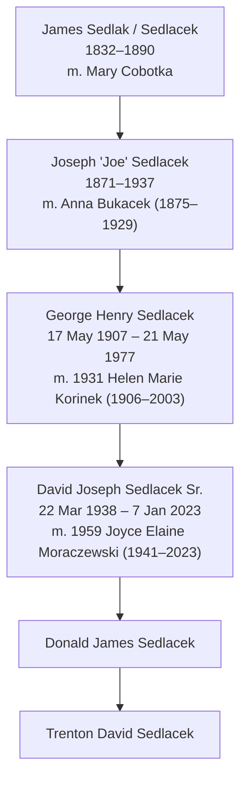

# Sedlacek patrilineal line

Father-to-son line from the earliest known Sedlacek down to Trenton David Sedlacek.

## Generations

| Gen | Name | Born | Died | Wife | Sources |
|---|---|---|---|---|---|
| 1 | James Sedlak (Sedlacek) | 1832 | 1890 | Mary Cobotka | IMG_2305.JPEG, FILE_4042 (1).pdf |
| 2 | Joseph "Joe" Sedlacek | 1871 | 1937 | Anna Bukacek (1875–1929) | Both charts; Find a Grave [22794841](https://www.findagrave.com/memorial/22794841/joseph-sedlacek) |
| 3 | George Henry Sedlacek | 17 May 1907, Plattsmouth, Cass Co., NE | 21 May 1977, Omaha, NE | Helen Marie Korinek (1906–2003), m. 1931 | Find a Grave [155297524](https://www.findagrave.com/memorial/155297524/george_henry-sedlacek); buried Calvary Catholic Cemetery, Omaha, Station 09 |
| 4 | David Joseph Sedlacek Sr. | 22 Mar 1938, Omaha, NE | 7 Jan 2023, Omaha, NE | Joyce Elaine Moraczewski (1941–2023), m. 1959 | Find a Grave [255616923](https://www.findagrave.com/memorial/255616923/david_joseph-sedlacek); buried Forest Lawn Memorial Park, Omaha |
| 5 | Donald James Sedlacek | | | | Family (Trenton) |
| 6 | Trenton David Sedlacek | | | | Self |

## Joseph Sedlacek's children (from Plattsmouth Journal clippings)

Clippings are saved in `clippings/`. Their issue dates weren't captured, so record them if you can.

Anna's 1929 obituary (11) says she was 54, lived in Plattsmouth most of her life, and **married Joseph there**. The family later moved "to other sections of Nebraska" and returned "several years ago." She left **five sons and one daughter**:

| Child | Residence in 1929 | Other evidence | Male line to trace? |
|---|---|---|---|
| Joseph A. Sedlacek | Grand Island, NE (married) | At Frances's 1932 wedding (14). Children: **Edgar** (son), Goldie Agnes (m. Lawrence Edward Gehley at St. Mary's Cathedral, Grand Island, Tue 11 Feb, probably 1941 since "the late Joseph and Anna"), and Camilla (17) | Yes: Edgar |
| Emil Joseph Sedlacek (1898–1992) | Green River, WY (married, had a baby) | Born Grand Island; died Denver (index). Visited parents (02, 08) | Yes |
| Albert Sedlacek | Junction City, KS (married) | At Anna's funeral (12) | Yes |
| Frank Valentine Sedlacek (1909–1981) | Omaha | "Youngest son." Married Rose Rozic at Holy Assumption, South Omaha; worked A.G. Bach stores, Burlington shops, Omaha packing houses (10) | Yes: likely sons Thomas G., Donald, Robert J., Frank Jr. |
| George Henry Sedlacek (1907–1977) | Plattsmouth | Married Helen Korneck (Korinek), daughter of Mr. and Mrs. V. Korneck, at St. Philip Neri, Florence, NE. Burlington shops, Knights of Columbus; moved to the Korinek farm at Florence (13). Bohemian Sluggers baseball (04) | Our line |
| Frances Sedlacek | Plattsmouth | "Only daughter." Married Frank J. Koubek (son of Adolph Koubek) at Holy Rosary (14) | No (female) |

Other facts from the clippings:
- **Anna's funeral** (12) was at Holy Rosary Church (West Pearl St.), with Father Jerry Hancik officiating. She was buried in "the Catholic cemetery west of this city" (Holy Sepulchre). Her surviving siblings were Mrs. Mary Wondra, Frank Bucacek, and Joe Bucacek of Reliance, S.D. (11).
- **Anna's family:** John Bucacek's obituary (he was 79, so this is Sept 1928) names his four children, including Mrs. Joseph Sedlacek. He came to Plattsmouth as a young man about 45 years earlier and worked about 25 years in the Burlington shops (09).
- **Mike Sedlak:** Adolph Bucacek of Reliance, S.D. visited "the Mike Sedlak and the Joseph Sedlacek homes" (05). That fits Mike being Joseph's brother but doesn't prove it. Mike is not listed among the family at Anna's funeral, which only named her husband and children.
- **Joseph Kofka** of Omaha and his wife attended Frances's wedding (14). Possibly related, perhaps a garbled form of Mary "Cobotka"'s surname. Speculative.
- **Home:** Joseph lived at the southwest corner of 15th and Main streets, Plattsmouth (15). He was once jailed after threatening the neighboring Kvapil family with an unloaded shotgun over a damaged grape vine.
- **Court:** Joseph pleaded not guilty before Judge C. L. Graves. The complaining witness was Mrs. Mary Kvapil. He was fined $8 plus costs, about $11.50 total (16).
- **Road work:** Joseph Sedlacek was paid $3.75 from the district road fund, road district 17 (19). The clipping's county and year are unknown.
- **Probably other Joseph Sedlaceks (not ours):** a Mrs. Joseph Sedlacek of Omaha was a sister of James Sykora (died in Omaha aged 70; 18). Our Joseph's wives don't fit that. A Joseph Sedlacek also appears on a 1902–1904 "Colfax" list (20); Colfax County, NE had many Sedlaceks. Neither is linked to this family yet.
- **Land:** Joseph sold part of the SE¼ NW¼ of Section 13, Township 12, Range 14 to Adolph Komenda for $1,700 (01).
- **Marriage record:** Joseph and Anna married in Plattsmouth before 1898, and Joseph A. was probably their eldest. The Cass County marriage record should name Joseph's parents and birthplace. This is now the best document to find.

## Other sons in each generation (collateral male lines)

Candidates from the Sep 2026 source search (unverified; see RESEARCH_SOURCES.md):

- James (gen 1): possible other sons Matej "Mike" Sedlak (1878–1960) and Thomas Sedlak (about 1876–1943), both of Plattsmouth.
- Joseph (gen 2): five sons, Joseph A., Emil, Albert, Frank, and George, confirmed by Anna's obituary (see table above).
- Frank Valentine's likely sons: Thomas Gregory (1942–2019), Donald, Robert J. "Bob," Frank Jr. Thomas's obituary names parents "Frank and Rose," which fits.
- Joseph A. (Grand Island): son Edgar, daughters Goldie Agnes (Gehley) and Camilla. Edgar's line not yet traced.
- Emil (Green River, WY) and Albert (Junction City, KS) lines: not yet traced.

- George Henry Sedlacek (gen 3) had sons Richard W. (1932–2001), George Daniel (1934–2014) and David Joseph Sr. (1938–2023), plus a daughter, Mary (Sedlacek) Moen, named in George Daniel's 2014 obituary.
- Richard W. Sedlacek (1932–2001) m. Patricia Ann Foltz; sons Craig Richard (1956–2008), Charles George "Chuck" (1964–2007) and Chad Michael (1966–2026); daughter Cynthia Joan (1954–1989).
- George Daniel Sedlacek (1934–2014), veteran, m. Merradean; son Matthew (m. Abby), daughters Celia (Weskamp) and Carolyn; grandchildren Kaitlin and Michael.
- David Joseph Sedlacek Sr. (1938–2023): sons David Joseph Jr. (1962–2021) and Donald James; daughter Denise J. (Sedlacek) Taylor, b. 1963 (the home person on both uploaded charts).

## Open questions and things to verify

1. James Sedlak / Sedlacek (1832–1890): the photo chart spells it "Sedlak," the PDF "Sedlacek." Birthplace (likely Bohemia) and where he died are unknown. His parents are blank on both charts, so the line currently stops here.
2. Mary Cobotka: no dates on either chart.
3. Joseph Sedlacek (1871–1937): exact birth/death dates and birthplace not captured yet. His Find a Grave page (22794841) should have them.
4. George Henry's page lists 1910, 1940 and 1950 censuses and a WWII draft card on Ancestry. The 1910 census should show him in Joseph's household in Plattsmouth, which would confirm the gen 2 to gen 3 link with a record rather than only the charts.
5. Donald James Sedlacek: add birth date and place, and his Find a Grave or other record if one exists. Note that David Sr.'s Find a Grave page lists only David Jr. as a child, so Donald could be added there as well.
6. Czech spelling: Sedláček (the surname means "farmer/smallholder" in Czech). Records before about 1900 may use Sedlacek, Sedlaček, Sedlak or Sedlatschek.

## Source files in this repo

- `IMG_2305.JPEG`: five-generation chart back to 5th great-grandparents, with dates, centered on Denise J. Sedlacek (b. 1963).
- `FILE_4042 (1).pdf`: "Sedlacek Family Tree" chart, same home person (Denise Sedlacek Taylor), without most dates.
