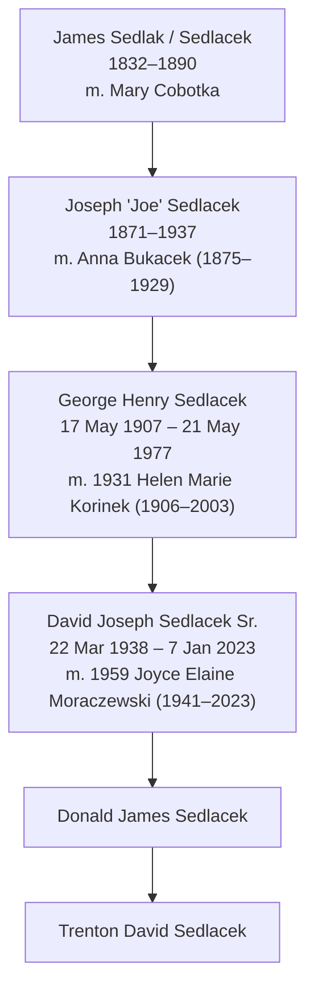

# Sedlacek patrilineal line

Father-to-son line from the earliest known Sedlacek down to Trenton David Sedlacek.

## Generations

| Gen | Name | Born | Died | Wife | Sources |
|---|---|---|---|---|---|
| 1 | James Sedlak (Sedlacek) | 1832 | 1890 | Mary Cobotka | IMG_2305.JPEG, FILE_4042 (1).pdf |
| 2 | Joseph "Joe" Sedlacek | 1871 | 1937 | Anna Bukacek (1875–1929) | Both charts; Find a Grave [22794841](https://www.findagrave.com/memorial/22794841/joseph-sedlacek) |
| 3 | George Henry Sedlacek | 17 May 1907, Plattsmouth, Cass Co., NE | 21 May 1977, Omaha, NE | Helen Marie Korinek (1906–2003), m. 1931 | Find a Grave [155297524](https://www.findagrave.com/memorial/155297524/george_henry-sedlacek); buried Calvary Catholic Cemetery, Omaha, Station 09 |
| 4 | David Joseph Sedlacek Sr. | 22 Mar 1938, Omaha, NE | 7 Jan 2023, Omaha, NE | Joyce Elaine Moraczewski (1941–2023), m. 1959 | Find a Grave [255616923](https://www.findagrave.com/memorial/255616923/david_joseph-sedlacek); buried Forest Lawn Memorial Park, Omaha |
| 5 | Donald James Sedlacek | | | | Family (Trenton) |
| 6 | Trenton David Sedlacek | | | | Self |

## Other sons in each generation (collateral male lines)

- George Henry Sedlacek (gen 3) had sons Richard W. (1932–2001), George Daniel (1934–2014) and David Joseph Sr. (1938–2023), plus a daughter, Mary (Sedlacek) Moen, named in George Daniel's 2014 obituary.
- Richard W. Sedlacek (1932–2001) m. Patricia Ann Foltz; sons Craig Richard (1956–2008), Charles George "Chuck" (1964–2007) and Chad Michael (1966–2026); daughter Cynthia Joan (1954–1989).
- George Daniel Sedlacek (1934–2014), veteran, m. Merradean; son Matthew (m. Abby), daughters Celia (Weskamp) and Carolyn; grandchildren Kaitlin and Michael.
- David Joseph Sedlacek Sr. (1938–2023): sons David Joseph Jr. (1962–2021) and Donald James; daughter Denise J. (Sedlacek) Taylor, b. 1963 (the home person on both uploaded charts).

## Open questions and things to verify

1. James Sedlak / Sedlacek (1832–1890): the photo chart spells it "Sedlak," the PDF "Sedlacek." Birthplace (likely Bohemia) and where he died are unknown. His parents are blank on both charts, so the line currently stops here.
2. Mary Cobotka: no dates on either chart.
3. Joseph Sedlacek (1871–1937): exact birth/death dates and birthplace not captured yet. His Find a Grave page (22794841) should have them.
4. George Henry's page lists 1910, 1940 and 1950 censuses and a WWII draft card on Ancestry. The 1910 census should show him in Joseph's household in Plattsmouth, which would confirm the gen 2 to gen 3 link with a record rather than only the charts.
5. Donald James Sedlacek: add birth date and place, and his Find a Grave or other record if one exists. Note that David Sr.'s Find a Grave page lists only David Jr. as a child, so Donald could be added there as well.
6. Czech spelling: Sedláček (the surname means "farmer/smallholder" in Czech). Records before about 1900 may use Sedlacek, Sedlaček, Sedlak or Sedlatschek.

## Source files in this repo

- `IMG_2305.JPEG`: five-generation chart back to 5th great-grandparents, with dates, centered on Denise J. Sedlacek (b. 1963).
- `FILE_4042 (1).pdf`: "Sedlacek Family Tree" chart, same home person (Denise Sedlacek Taylor), without most dates.
